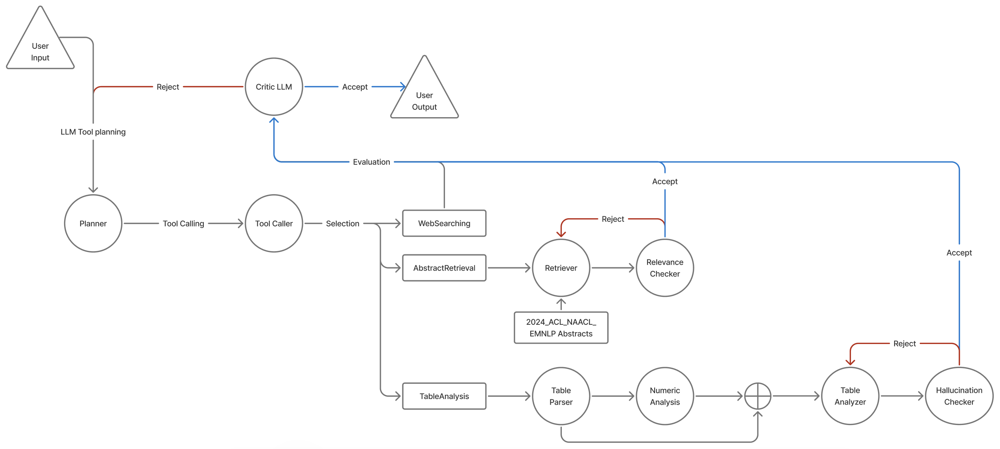
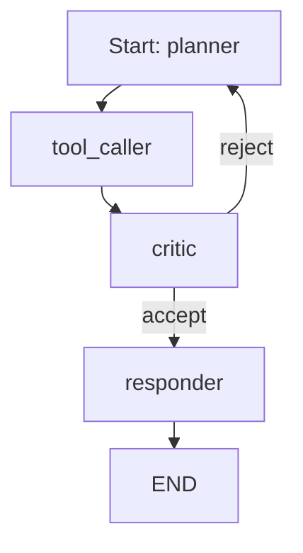
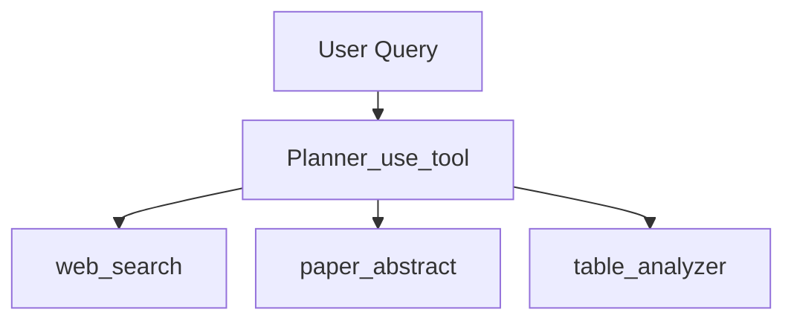
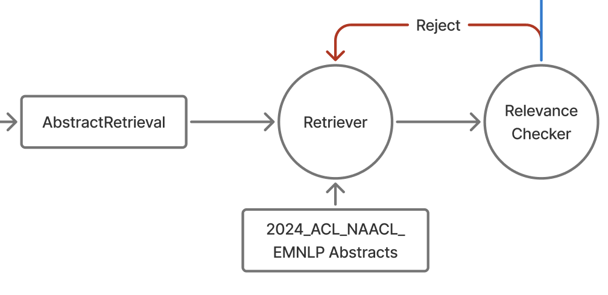
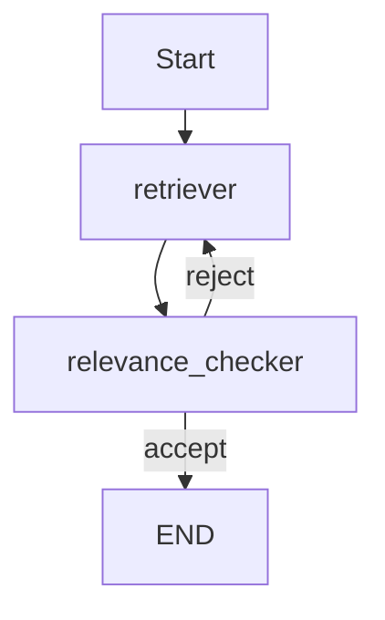
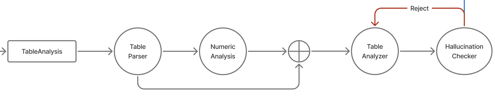
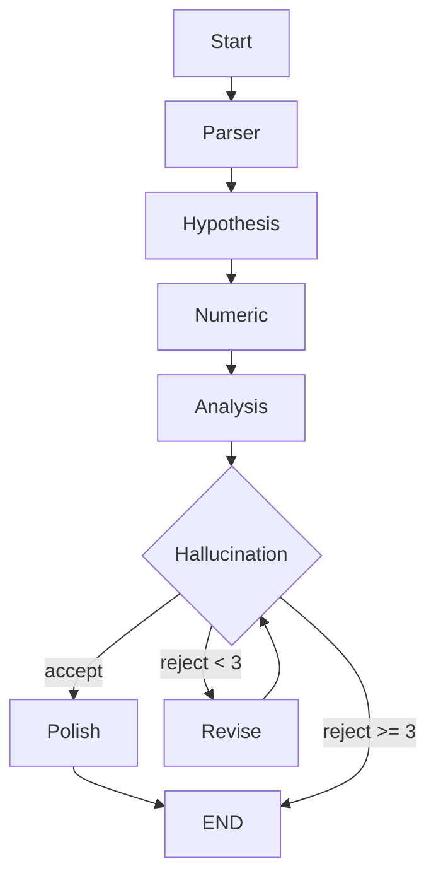
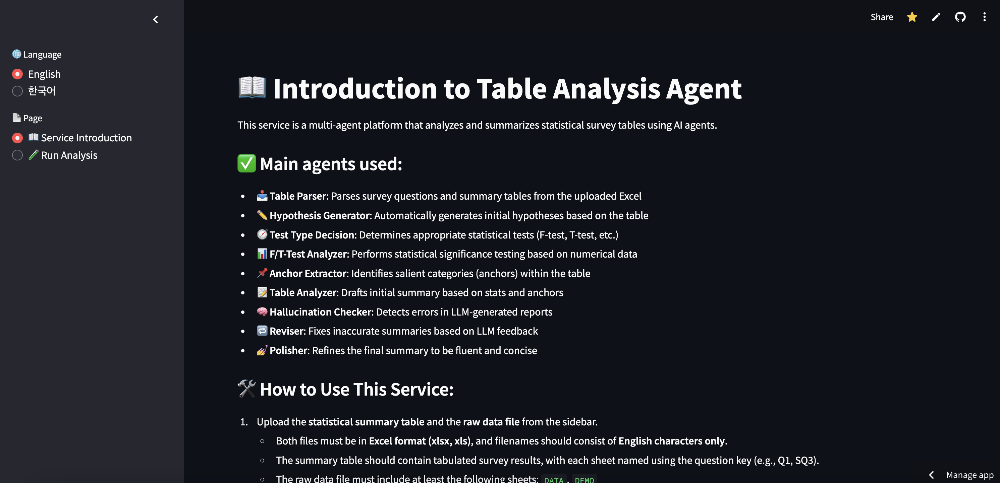
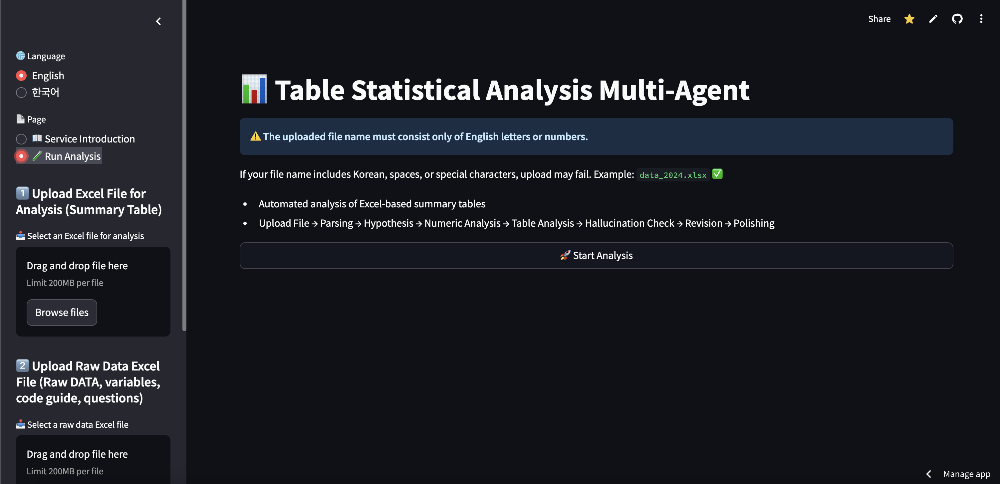

# Tool_Agent_PCRP

LangGraph 기반의 Tool-Using Agent 프로젝트입니다.  
이 에이전트는 다음과 같은 구조를 따릅니다:

> **P**lanning → Tool Execution → **C**ritic Evaluation → (**R**e-)**P**lanning  

본 프로젝트는 Tool Critic Agent 개발 이후, LangGraph 기반의 다양한 유용한 Tool 연구 및 개발에 집중하고 있습니다.  
 Critic Loop은 기본 프레임워크로만 구축되었으며, 주요 목표는 실험적 Tool Agent 설계 및 최적화입니다.
## System Overview



### Main System Mermaid Pipeline Diagram


---

## 구성 개요

- **LangGraph**를 활용한 DAG 기반 에이전트 흐름
- **Planner**: LLM이 입력 질의에 대한 계획 수립
- **Tool Agent**: Function Calling 기반으로 적절한 도구 자동 실행
- **Critic**: 실행 결과 평가 및 accept/reject 판단
- **Replanning Loop**: 필요 시 다시 planner로 되돌아가 반복 수행

---

## Tool List



### Web Search Tool:
- Using duckduckgo_search API for web searching
    

### Top-Tier Conference Abstract Analysis Tool: 
- Custom LangGraph Multi-Agent
    - Start → User Inpur Query → Abstracts Retrieval → Retrieved Documents Relevance Check → Critic Checker → Generation Output



#### Abstract Analysis Tool Mermaid Pipeline Diagram


### Social Survey Structure data (e.g. table) analysis Tool: 
- Custom LangGraph Multi-Agent
    - **Start** → **User Inpur Query** → **Retrieval Survey File**(excel, csv, ...) → **Table Parser** → **Generating Hypothesis** about rows and columns → Table **Numeric Analysis**(Pandas - mean, min, max , ...) → **Table Analysis**(Numeric + Linearlized Table + Hypothesis + User Question) → Generated Analysis Result **Hallucination Check** → **Revision** Analysis (If Needed) → Sentence **Polishing** → **Critic Checker** → **Generation Output**



#### Social Survey Structure data analysis Tool Mermaid Pipeline Diagram



#### 🔗 Demo Link (Try It Out!)

👉 You can try the live demo here:  
[🌐 Launch Streamlit App](https://statistical-ai.streamlit.app/)  




---


# 디렉토리 구조
```plaintext
Tool_Agent_PCRP/   
├── main.py  
├── .gitignore  
├── Readme.md  
├── requirements.txt  
├── AbstractFlow.png  
├── SysyemOverview.png  
├── TableFlow.png  
├── graph/  
│   └── workflow_graph.py  
├── agents/  
│   ├── critic_agent.py  
│   ├── planner_agent.py  
│   ├── responder_agent.py  
│   ├── tools.py  
│   ├── tools_schema.py  
│   ├── abstract_agents/  
│   │   ├── Top_Tier_Crawling.py  
│   │   ├── abstract_main.py  
│   │   ├── get_image.py  
│   │   ├── agents_B/  
│   │   │   ├── retriever_agent.py  
│   │   │   ├── relevance_checker_agent.py  
│   │   │   ├── abstract_analysis_agent.py  
│   │   │   └── hallucination_checker_agent.py  
│   │   └── abstract_graph/  
│   │       └── abstract_workflow_graph.py  
│   └── table_agents/  
│       ├── table_main.py  
│       ├── table_list/  
│       │   ├── 서울시 대기환경 시민인식 조사.xlsx  
│       │   ├── 고양시 도시주거환경정비기본계획 조사.xlsx  
│       └── agent_C/  
│       │   ├── hallucination_check_agent.py  
│       │   ├── hypothesis_generation.py  
│       │   ├── numeric_anaylsis_agent.py  
│       │   ├── polish_agent.py  
│       │   ├── retrieval_file_agent.py  
│       │   ├── revision_agent.py  
│       │   ├── table_analysis_agent.py  
│       │   └── table_parser.py  
│       └── table_graph/  
│           └── table_workflow_graph.py  
```
