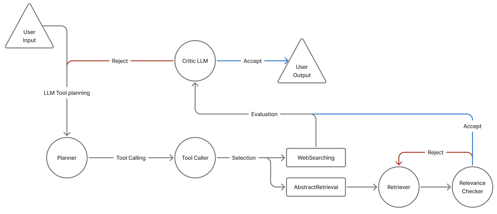

# Tool_Agent_PCRP

LangGraph 기반의 Tool-Using Agent 프로젝트입니다.  
이 에이전트는 다음과 같은 구조를 따릅니다:

> **P**lanning → **Tool Execution** → **Critic Evaluation** → (Re-)**Planning**
## System Overview

---

## 구성 개요

- **LangGraph**를 활용한 DAG 기반 에이전트 흐름
- **Planner**: LLM이 입력 질의에 대한 계획 수립
- **Tool Agent**: Function Calling 기반으로 적절한 도구 자동 실행
- **Critic**: 실행 결과 평가 및 accept/reject 판단
- **Replanning Loop**: 필요 시 다시 planner로 되돌아가 반복 수행

---

## Tool List

### Web Search Tool:
- Using duckduckgo_search API for web searching
    

### Top-Tier Conference Abstract Analysis Tool: 
- LangGraph Multi-Agent
    - Start → User Inpur Query → Abstracts Retrieval → Retrieved Documents Relevance Check → Critic Checker → Generation Output
 
### Social Survey Structure data (like, table) analysis Tool: 
- LangGraph Multi-Agent
    - Start → User Inpur Query → Retrieval Survey File(excel, csv, ...) → Table Parser → Table Numeric Analysis(Pandas - mean, min, max , ...) → Table Analysis(Numeric + Linearlized Table + User Question) → Generated Analysis Result Hallucination Check → Critic Checker → Generation Output

---

## 디렉토리 구조
Tool_Agent_PCRP/  
├── main.py  
├── graph/  
├── agents/  
├── tools/  
└── README.md  

