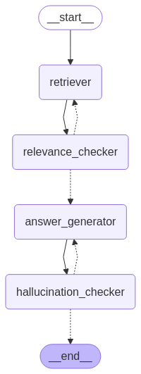

# Tool_Agent_PCRP

LangGraph 기반의 Tool-Using Agent 프로젝트입니다.  
이 에이전트는 다음과 같은 구조를 따릅니다:

> **P**lanning → **Tool Execution** → **Critic Evaluation** → (Re-)**Planning**
## 🔧 Workflow Graph

---

## 🧠 구성 개요

- **LangGraph**를 활용한 DAG 기반 에이전트 흐름
- **Planner**: LLM이 입력 질의에 대한 계획 수립
- **Tool Agent**: Function Calling 기반으로 적절한 도구 자동 실행
- **Critic**: 실행 결과 평가 및 accept/reject 판단
- **Replanning Loop**: 필요 시 다시 planner로 되돌아가 반복 수행

---

## 📁 디렉토리 구조
Tool_Agent_PCRP/  
├── main.py  
├── graph/  
├── agents/  
├── tools/  
└── README.md  

---

## 🚧 향후 추가 예정

- [ ] 각 도구 설명 및 schema 문서화
- [ ] Web UI 연동 (Streamlit/Gradio 등)
- [ ] 고급 도구 (SQL, 웹 크롤링, 시각화 등) 통합
